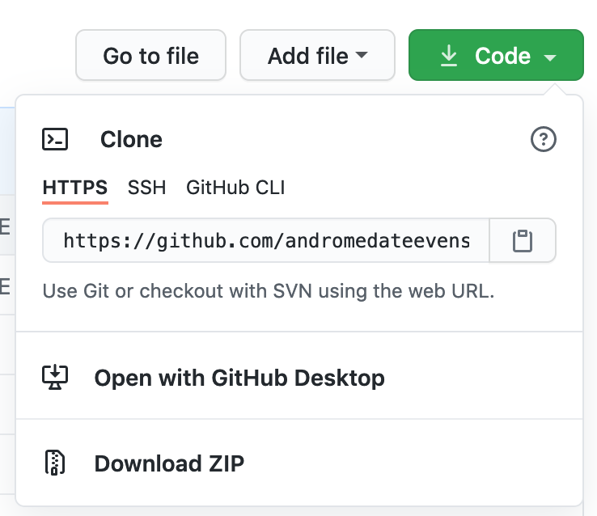

# Random Reward for YNAB
A script that uses an existing YNAB budget and the power of intermittent reinforcement to incentivize you to complete tasks. It uses the YNAB API to stochastically transfer money to a fun money category you set every time you finish a task. 

## Prerequisites
Random Reward for YNAB (RRY) requires the following Python libraries for functionality:

* [Requests](https://requests.readthedocs.io/en/master/)
* [Arrow](https://arrow.readthedocs.io/en/stable/)

Ensure that these are installed before proceeding:

```shell
$ python3 -m pip install -r requirements.txt
```

## Installation and Setup
First, you need to download a copy of RRY onto your computer. This can be done in a number of ways. You can clone the repo onto your local machine by using the command below:

```shell
$ git clone https://github.com/andromedateevens/random_reward_for_ynab && cd random_reward_for_ynab
```

You can also download the project as a zip file. To do this, find the green button labelled Code, then click on "Download ZIP"



Once you have downloaded the project, you will need to edit `parameters.json` to correspond to your YNAB setup. If you open that file you will see the following:

```shell
{
	"default":
	{
	    "token": "Put Token Here",
	    "budget_name": "My Budget",
	    "budget_id": null,
	    "category_from_name": "Reward Money",
	    "category_from_id": null,
	    "category_to_name": "Fun Money",
	    "category_to_id": null,
	    "amount": 1.0,
	    "random_threshold": 0.5
	}
}
```

We will go through each of these parameters in turn. First of all you will need a security token, which allows RRY to communicate with your YNAB account. You can use [this guide from YNAB](https://api.youneedabudget.com/#personal-access-tokens) to create a token. Copy the token to your clipboard and replace "Put Token Here" with it, keeping the quotation marks.

IMPORTANT NOTE: Do not share your token with anyone. Use it only with your local copy of RRY.  It's a good idea to run

```shell
$ git update-index --assume-unchanged parameters.json
```
so you don't accidentally commit your YNAB API token.

Besides the token, the remaining paramters are largely self-explanatory. Budget and category IDs should be left as null, as they will be assigned when the main script is run; if for some reason you want to enter them manually you may, but this is not recommended. Budget and category names must match exactly, including spaces and capitalization. `category_from` refers to the category you wish to transfer money out of, and `category_to` refers to the category you wish to transfer money into. `amount` is the amount of money in dollars that should be transferred. `random_threshold` is the probablity that money will be transferred each time you run RRY. The default value of 0.5 corresponds to a 50% chance for transfer each time; 0.1 would correspond to 10%, and so on.

## Usage
The idea behind RRY is that intermittent reinforcement is more effective than consistent reinforcement; if you recieve an award every time you complete a task you will complete that task as often as you want the reward (assuming the task is easy). However, if you recieve a reward a random percentage of the time that you complete a task, you will be more likely to complete the task due to the unpredictibility of the reward. With that in mind, you should run RRY when you complete a task using the following command in the random_reward_for_ynab directory:

```shell
$ python random_reward.py
```

RRY will then generate a random number and transfer money into your designated account if that number is greater than `random_threshold`. Enjoy your intermittent reinforcement!

You can also specify alternate values for the parameters via command line keywords or alternate profiles. For example, if you run:

```shell
$python random_reward.py --amount 5
```

then RRY will run using the default parameters but with amount equal to 5 instead of whatever it is in the default. This can be done with budget name, category names, amount and threshold. If however you want to save some of these parameters for repeated use, you will need to create a new profile. This can be done in `parameters.json` by creating a seperate parameter list, like so:

```shell
{
	"default":
	{
	    "token": "Put Token Here",
	    "budget_name": "My Budget",
	    "budget_id": null,
	    "category_from_name": "Reward Money",
	    "category_from_id": null,
	    "category_to_name": "Fun Money",
	    "category_to_id": null,
	    "amount": 1.0,
	    "random_threshold": 0.5
	},
	"big_task":
	{
		"category_to_name": "Very Fun Money",
		"amount": 5,
		"random_threshold": 0.8
	}
}
```

To use this new profile, run:

```shell
$python random_reward.py --profile big_task
```

This can be combined with keywords as above. Any parameters not specified by the new profile will be taken from default, so in this case money will be transferred from "Reward Money" to "Very Fun Money".